# Desain Arsitektur: Class Diagram Perkebunan (Farmease Gardening)

Dokumen ini memuat **Class Diagram** utama yang memodelkan keseluruhan modul yang ada di dalam Go Backend Perkebunan (`kebun-be`). Seluruh entitas perkebunan terhubung menggunakan relasi standar UML, menggabungkan data (atribut) dan perilaku (metode) langsung di dalam kelas entitas utama sesuai dengan prinsip pemrograman berorientasi objek (OOP).

---

## Class Diagram Backend Perkebunan (`kebun-be`)

Diagram ini dimodelkan menggunakan format kelas Mermaid dengan seluruh atribut diatur sebagai private (`-`) dengan format `- nama_variabel : tipe_data`, serta metode publik (`+`) dengan format `+ nama_metode(parameter) : tipe_kembalian`.

```mermaid
classDiagram
    %% ==========================================
    %% ENTITAS & METODE (OOP CLASSES)
    %% ==========================================
    class Lahan {
        - IDLahan : uuid
        - KodeLahan : string
        - NamaLahan : string
        - JenisTanaman : string
        - StatusLahan : int
        - LuasLahan : float
        - CreatedAt : date
        - UpdatedAt : date
        + GetLahanList(filter : LahanFilter) : Lahan[]
        + CreateLahan(lahan : Lahan) : bool
        + UpdateLahan(id : string, lahan : Lahan) : bool
        + DeleteLahan(id : string) : bool
    }

    class Pohon {
        - IDPohon : uuid
        - KodePohon : string
        - Varietas : string
        - TanggalTanam : date
        - FasePohon : string
        - LahanID : uuid
        - StatusPohon : string
        - CreatedAt : date
        - UpdatedAt : date
        + GetPohonList(lahanID : uuid) : Pohon[]
        + CreatePohon(p : Pohon) : bool
        + UpdatePohon(id : string, p : Pohon) : bool
        + DeletePohon(id : string) : bool
    }

    class Aktivitas {
        - IDAktivitas : uuid
        - TanggalAktivitas : date
        - NamaJenisAktivitas : string
        - NamaRincianAktivitas : string
        - LahanID : uuid
        - CreatedAt : date
        - UpdatedAt : date
        + RecordActivity(act : Aktivitas) : bool
        + GetActivityHistory(lahanID : uuid) : Aktivitas[]
    }

    class Penyiraman {
        - IDPenyiraman : uuid
        - TeknikPenyiraman : string
        - Deskripsi : string
        - LahanID : uuid
        - AktivitasID : uuid
        + RecordPenyiraman(p : Penyiraman) : bool
    }

    class Pemangkasan {
        - IDPemangkasan : uuid
        - Jumlah : float
        - Satuan : string
        - Kesediaan : string
        - Keterangan : string
        - LahanID : uuid
        - AktivitasID : uuid
        - IDStokBahan : uuid
        + RecordPemangkasan(p : Pemangkasan) : bool
    }

    class Panen {
        - IDPanen : uuid
        - Jumlah : float
        - Satuan : string
        - Keterangan : string
        - LahanID : uuid
        - AktivitasID : uuid
        + RecordPanen(p : Panen) : bool
    }

    class Pembersihan {
        - IDPembersihan : uuid
        - TeknikPembersihan : string
        - Deskripsi : string
        - LahanID : uuid
        - AktivitasID : uuid
        - IDStokBahan : uuid
        + RecordPembersihan(p : Pembersihan) : bool
    }

    class Pengobatan {
        - IDPengobatan : uuid
        - NamaObat : string
        - Dosis : float
        - Satuan : string
        - BagianPohon : string
        - Deskripsi : string
        - DetailPohon : string
        - LahanID : uuid
        - AktivitasID : uuid
        - IDStokObat : uuid
        + RecordPengobatan(p : Pengobatan) : bool
    }

    class Penanaman {
        - IDPenanaman : uuid
        - FasePohon : string
        - Varietas : string
        - Deskripsi : string
        - LahanID : uuid
        - AktivitasID : uuid
        + RecordPenanaman(p : Penanaman) : bool
    }

    class Pembuahan {
        - IDPembuahan : uuid
        - FasePohon : string
        - TeknikPembuahan : string
        - Deskripsi : string
        - LahanID : uuid
        - AktivitasID : uuid
        + RecordPembuahan(p : Pembuahan) : bool
    }

    class Pemupukan {
        - IDPemupukan : uuid
        - NamaPupuk : string
        - Dosis : float
        - Satuan : string
        - Deskripsi : string
        - ManureID : uuid
        - IDStokPupuk : uuid
        - LahanID : uuid
        - AktivitasID : uuid
        + RecordPemupukan(p : Pemupukan) : bool
    }

    class StokBahan {
        - IDStokBahan : uuid
        - NamaBahan : string
        - StokTersedia : float
        - Satuan : string
        + GetStokBahanList() : StokBahan[]
        + UpdateStokBahan(id : uuid, qty : float) : bool
    }

    class StokPupuk {
        - IDStokPupuk : uuid
        - NamaPupuk : string
        - Kategori : string
        - StokTersedia : float
        - Satuan : string
        + GetStokPupukList() : StokPupuk[]
        + UpdateStokPupuk(id : uuid, qty : float) : bool
    }

    class StokObat {
        - IDStokObat : uuid
        - NamaObat : string
        - StokTersedia : float
        - Satuan : string
        + GetStokObatList() : StokObat[]
        + UpdateStokObat(id : uuid, qty : float) : bool
    }

    class FermentasiPupuk {
        - IDFermentasi : uuid
        - TanggalMulai : date
        - TargetPupukName : string
        - TargetJumlah : float
        - Satuan : string
        - Status : string
        - Notes : string
        - IDStokBahan : uuid
        - IDAccount : uuid
        + CreateFermentasi(f : FermentasiPupuk) : bool
        + GetFermentasiList() : FermentasiPupuk[]
    }

    class LogFermentasiPupuk {
        - IDLog : uuid
        - IDFermentasi : uuid
        - TanggalCek : date
        - Suhu : float
        - Kelembaban : float
        - KondisiFisik : string
        - Notes : string
        - Status : string
        - IDAccount : uuid
        + CreateLogFermentasi(l : LogFermentasiPupuk) : bool
    }

    class Submission {
        - IDSubmission : string
        - Type : string
        - OperatorName : string
        - ApprovalStatus : string
        - Payload : object
        + CreateSubmission(sub : Submission) : bool
        + GetSubmissions(status : string) : Submission[]
        + ApproveSubmission() : bool
    }

    class Notification {
        - IDNotification : uuid
        - Title : string
        - Message : string
        - IsRead : bool
        - IDAccount : uuid
        - TaskID : uuid
        - SubmissionID : string
    }

    class Task {
        - IDTask : uuid
        - Title : string
        - Description : string
        - Status : string
        - TaskDate : date
        - IDCage : uuid
        - IDAccount : uuid
        + GetMyTasks(id : string, role : string, date : date) : Task[]
        + CreateTask(t : Task) : bool
    }

    class RoutineSchedule {
        - IDSchedule : uuid
        - Title : string
        - Frequency : string
    }

    %% ==========================================
    %% NOTASI RELASI UML STANDAR
    %% ==========================================
    
    %% Komposisi: Lahan tersusun dari Pohon & Aktivitas
    Lahan "1" *-- "*" Pohon : Composition
    Lahan "1" *-- "*" Aktivitas : Composition

    %% Komposisi: Detail aktivitas bergantung sepenuhnya pada Aktivitas induk
    Aktivitas "1" *-- "0..1" Penyiraman : Composition
    Aktivitas "1" *-- "0..1" Pemangkasan : Composition
    Aktivitas "1" *-- "0..1" Panen : Composition
    Aktivitas "1" *-- "0..1" Pembersihan : Composition
    Aktivitas "1" *-- "0..1" Pengobatan : Composition
    Aktivitas "1" *-- "0..1" Penanaman : Composition
    Aktivitas "1" *-- "0..1" Pembuahan : Composition
    Aktivitas "1" *-- "0..1" Pemupukan : Composition

    %% Komposisi: Log Fermentasi bergantung pada Batch Fermentasi
    FermentasiPupuk "1" *-- "*" LogFermentasiPupuk : Composition

    %% Asosiasi: Relasi Lahan dengan tugas harian
    Lahan "1" --> "*" Task : Association (task location)
    Task "*" --> "1" RoutineSchedule : Association (generated by)

    %% Asosiasi: Relasi stok dengan aktivitas pemakaian
    StokBahan "1" --> "*" Pemangkasan : Association (material source)
    StokBahan "1" --> "*" Pembersihan : Association (material source)
    StokObat "1" --> "*" Pengobatan : Association (medicine source)
    StokPupuk "1" --> "*" Pemupukan : Association (fertilizer source)
    StokBahan "1" --> "*" FermentasiPupuk : Association (raw material)

    %% Asosiasi: Persetujuan dan Notifikasi
    Notification "1" --> "0..1" Submission : Association
    Submission "1" --> "0..1" Task : Association
```

---

## Penjelasan Relasi UML Kelas Perkebunan

1. **Komposisi (Composition - Simbol `*--` / Berlian Hitam)**
   * `Lahan` ke `Pohon` & `Aktivitas`: Pohon dan aktivitas kebun tidak memiliki eksistensi sendiri jika `Lahan` dihapus.
   * `Aktivitas` ke Detail Aktivitas (`Penyiraman`, `Pemangkasan`, `Panen`, dll.): Log detail hanya ada sebagai perpanjangan dari objek `Aktivitas` utama.
   * `FermentasiPupuk` ke `LogFermentasiPupuk`: Catatan harian log perkembangan fermentasi akan ikut terhapus jika batch utama `FermentasiPupuk` dihapus.
2. **Asosiasi (Association - Simbol `-->` / Anak Panah Biasa)**
   * Menghubungkan kelas-kelas transaksional dengan referensi stok bahan (`StokBahan`, `StokPupuk`, `StokObat`) dan operasional penugasan (`Task`, `RoutineSchedule`).
