# Sequence Diagram Modular: Alur Fungsional Perkebunan (Farmease Gardening) — Versi Revisi

Dokumen ini memuat diagram urutan (*sequence diagram*) dalam format Mermaid Markdown untuk masing-masing Use Case pada modul Perkebunan Farmease, diselaraskan dengan skenario Use Case revisi (4 Use Case).

---

## UC-01: Melihat Dasbor

Aktor memantau ringkasan kondisi terkini perkebunan melalui dasbor secara *real-time*.

### Normal-1: Pemilik melihat dasbor perkebunan
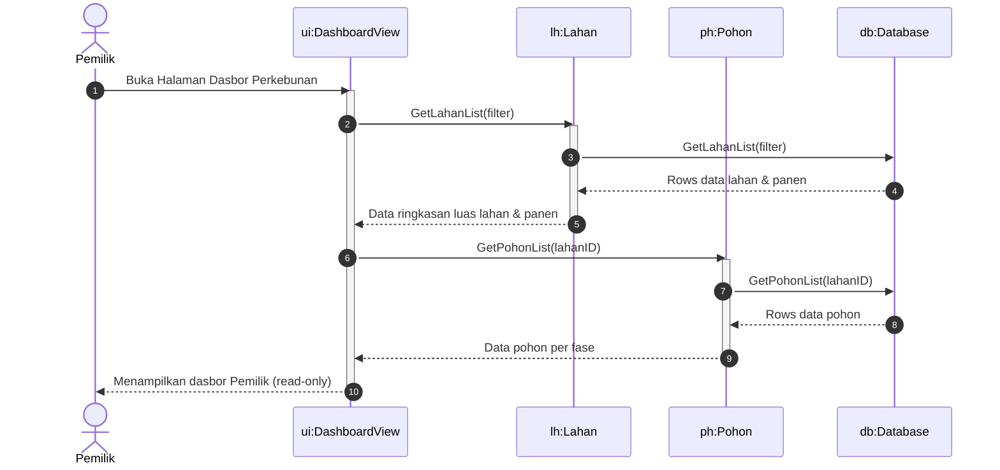

### Normal-2: Admin melihat dasbor perkebunan
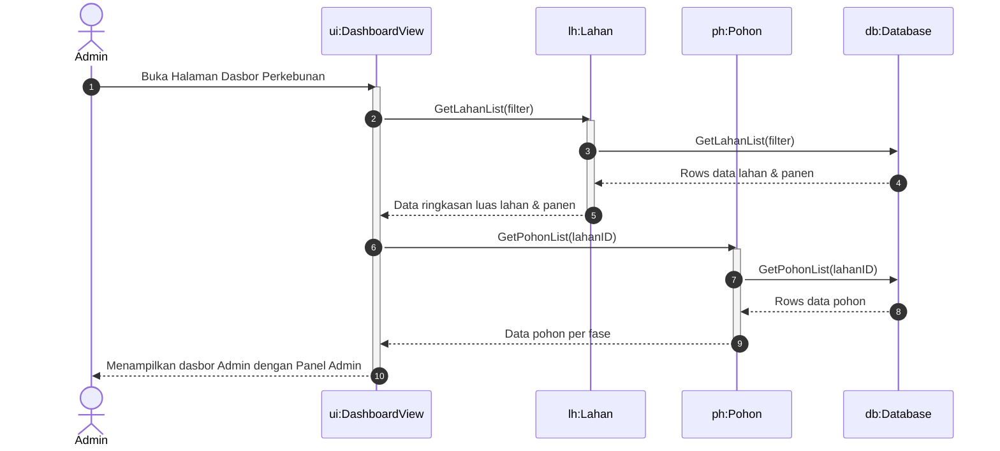

### Normal-3: Operator Kebun melihat dasbor perkebunan
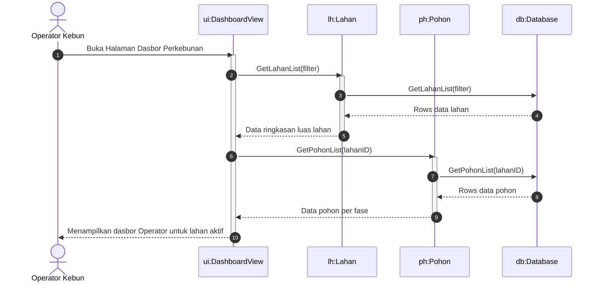

### Tidak Normal-1: Dasbor gagal dimuat
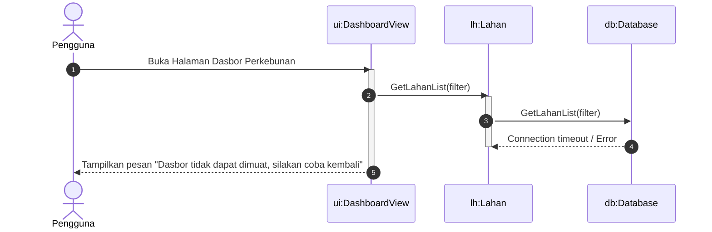

---

## UC-02: Kelola Data Pengolahan Pupuk

Operator Kebun mengelola pencatatan fermentasi pupuk dan pengecekan berkala (cek fermentasi).

### Normal-1: Operator Kebun mencatat proses fermentasi pupuk
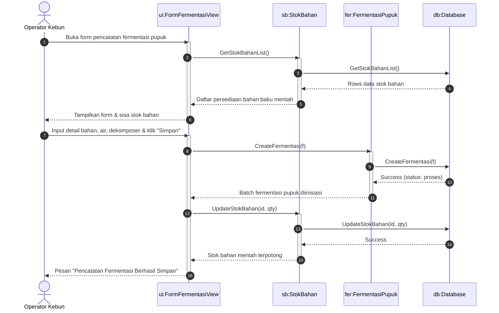

### Normal-2: Operator melakukan cek fermentasi dan pupuk siap digunakan
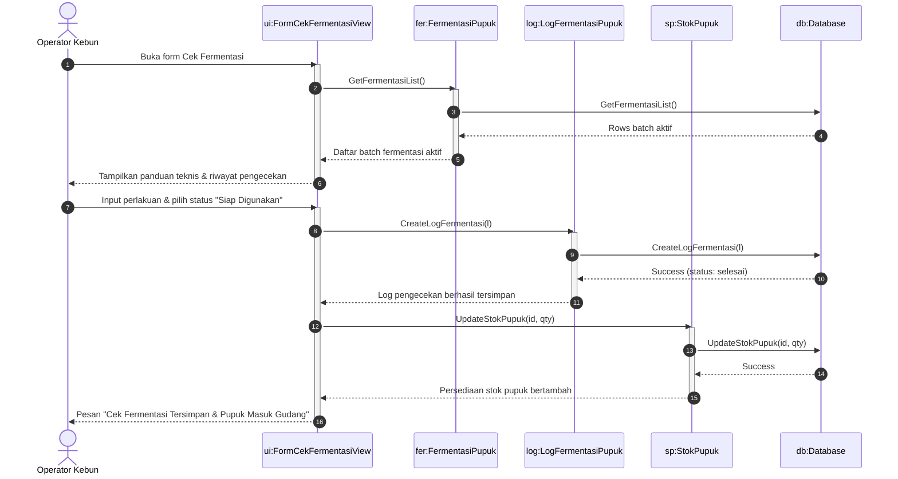

### Normal-3: Operator mencatat kegagalan proses fermentasi
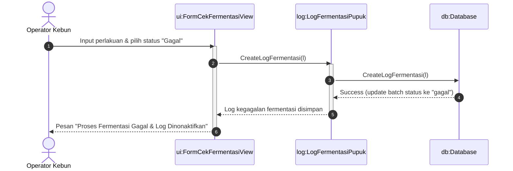

### Tidak Normal-1: Pencatatan pengolahan pupuk gagal (Validasi)
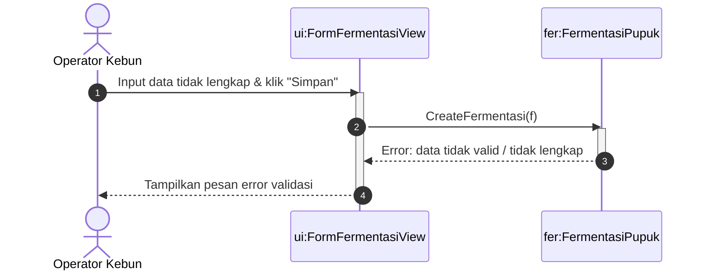

### Tidak Normal-2: Inisiasi Fermentasi Melebihi Persediaan Stok
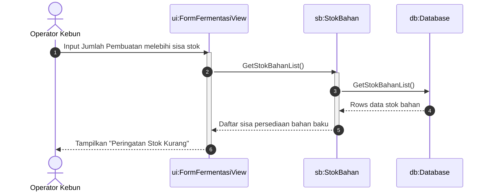

---

## UC-03: Kelola Data Pemupukan

Operator mencatat pemupukan harian pada pohon tertentu dibantu rekomendasi pupuk otomatis.

### Normal-1: Membuka formulir pencatatan pemupukan
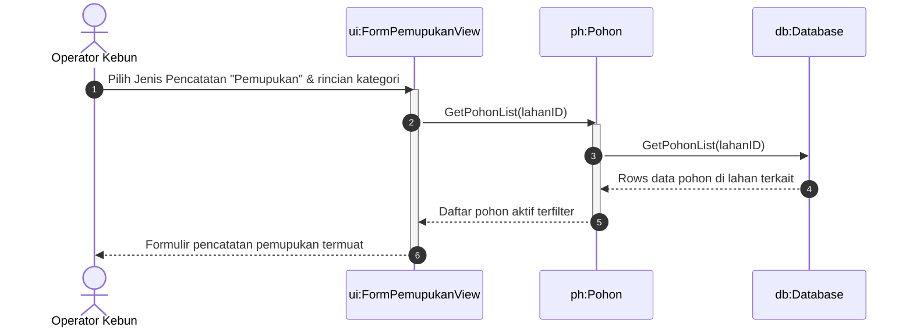

### Normal-2: Operator mencatat pemupukan (fermentasi)
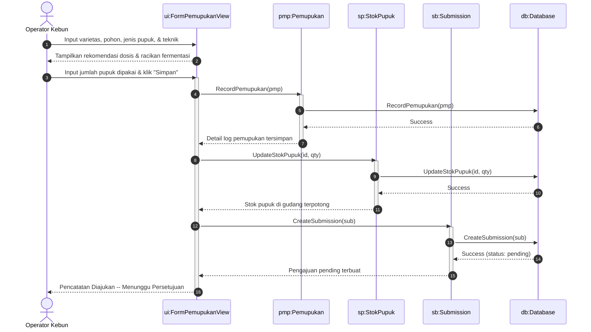

### Tidak Normal-1: Pencatatan pemupukan gagal (Validasi)

### Tidak Normal-2: Pencatatan pemupukan melebihi stok gudang
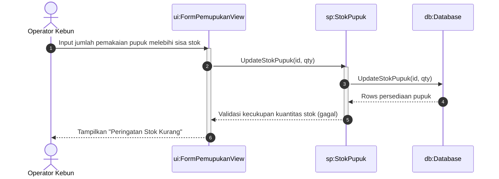

---

## UC-04: Kelola Data Pemberian Obat

Operator mencatat aktivitas pemberian obat dibantu rekomendasi obat dan jenis OPT.

### Normal-1: Membuka formulir pemberian obat
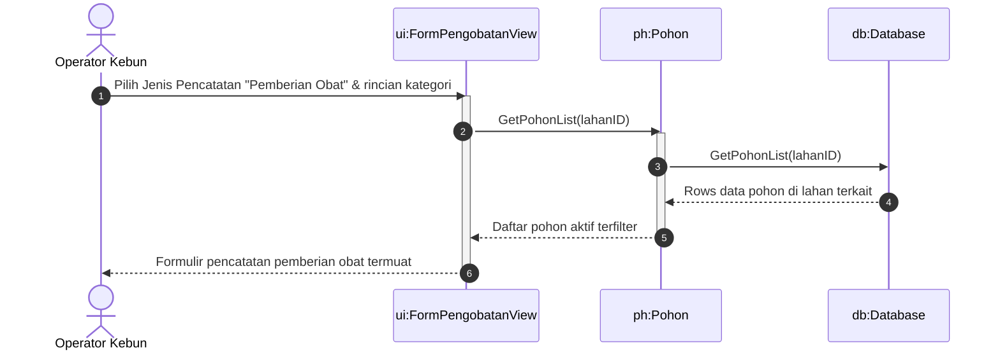

### Normal-2: Operator mencatat pemberian obat
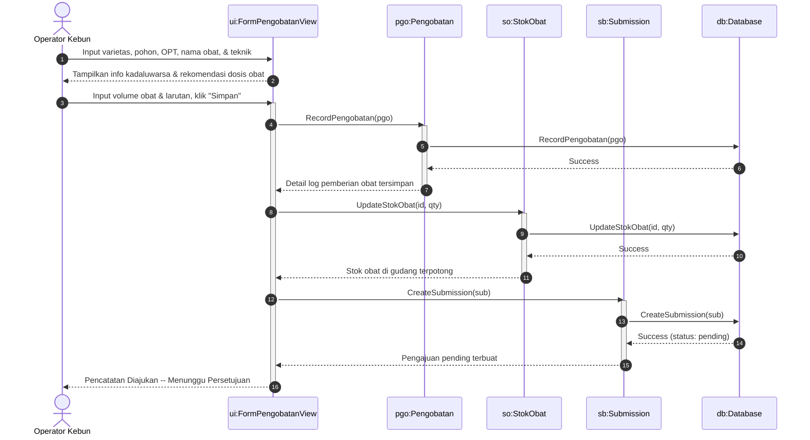

### Tidak Normal-1: Pencatatan pemberian obat gagal (Validasi)
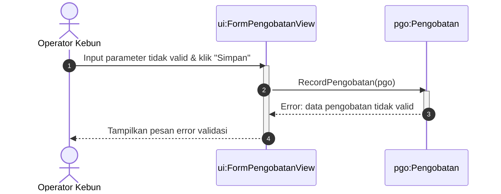

### Tidak Normal-2: Pencatatan pemberian obat melebihi stok gudang
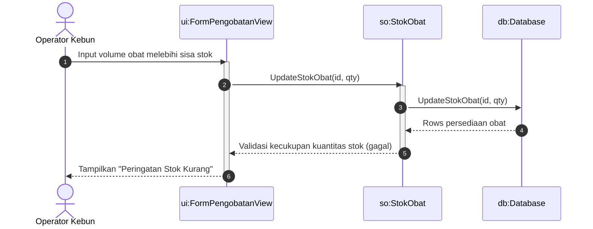
