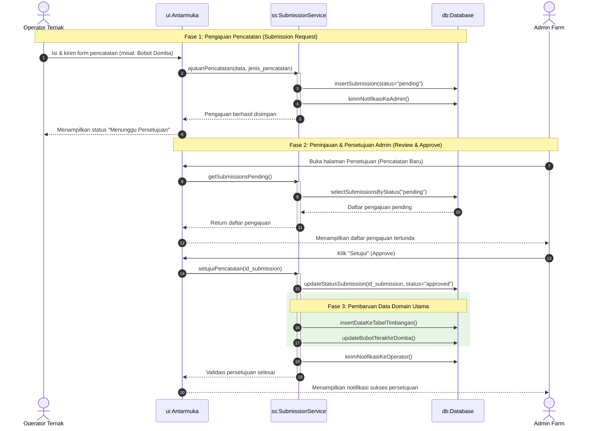
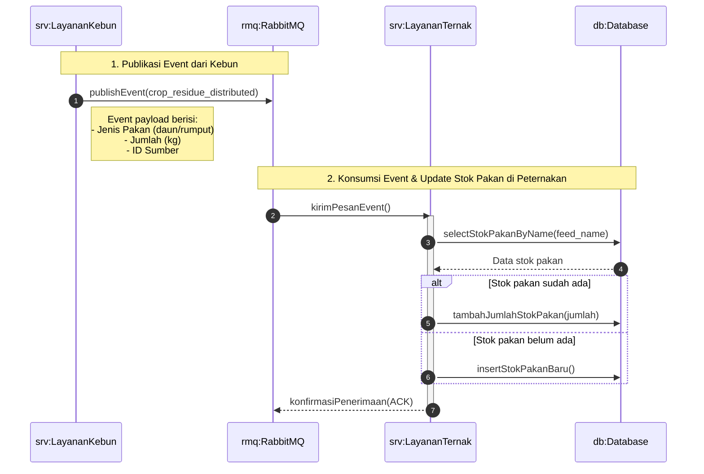

# Desain Arsitektur: Sequence Diagram Sistem Peternakan (Farmease)

Dokumen ini memuat diagram urutan (*sequence diagram*) arsitektur untuk menggambarkan bagaimana data mengalir di dalam sistem Peternakan Farmease, memetakan alur konseptual tingkat tinggi antara aktor, antarmuka frontend, backend service, dan database.

---

## 1. Diagram Alur Pengajuan & Persetujuan Pencatatan (Submission & Approval Workflow)

Diagram ini mengilustrasikan alur ketika seorang Operator mengajukan pencatatan baru (seperti penimbangan bobot atau kesehatan) hingga disetujui oleh Admin dan memperbarui kondisi data domba.

---

## 2. Diagram Alur Distribusi Sisa Panen (Gardening Crop Residue Integration)

Diagram ini menggambarkan integrasi asinkron (*event-driven*) menggunakan broker pesan untuk menyalurkan sisa hasil pemangkasan/kebun perkebunan sebagai stok pakan ternak.

