# Desain Arsitektur: Class Diagram Backend Peternakan (Farmease)

Dokumen ini memuat **Class Diagram** utama yang memodelkan keseluruhan 16 modul yang ada di dalam Go Backend Peternakan (`farmease-be`). Seluruh entitas dan layanan saling terhubung menggunakan relasi standar UML sehingga tidak ada kelas yang terisolasi tanpa hubungan.

---

## Class Diagram Backend (`farmease-be`)

Diagram ini dimodelkan menggunakan format kelas Mermaid lengkap dengan atribut data, relasi UML standar, serta metode yang sesuai dengan implementasi *delivery/handler* backend:

```mermaid
classDiagram
    %% ==========================================
    %% 1. ENTITAS (DATA MODELS)
    %% ==========================================
    class Farm {
        +string IDFarm
        +string FarmName
        +string Location
    }

    class Cage {
        +string IDCage
        +string CageCode
        +string CageName
        +int Capacity
        +int Occupancy
        +string IDFarm
    }

    class Sheep {
        +string IDSheep
        +string SheepCode
        +string SheepName
        +string Gender
        +string Status
        +float LastWeight
        +string IDCage
    }

    class Mating {
        +string IDMating
        +string IDSheepMale
        +string IDSheepFemale
        +date MatingDate
        +string Status
    }

    class Pregnancy {
        +string IDPregnancy
        +string IDSheepFemale
        +date MatingDate
        +date EstBirthDate
        +string Status
    }

    class Feed {
        +string IDFeed
        +string FeedName
        +float Stock
        +string Unit
    }

    class FeedingLog {
        +string IDFeedingLog
        +string IDCage
        +string IDFeed
        +float Quantity
        +date FedAt
    }

    class FermentationLog {
        +string IDFermentationLog
        +string IDConversion
        +float Temperature
        +string Notes
    }

    class HealthRecord {
        +string IDHealthRecord
        +string IDSheep
        +string Diagnosis
        +string MedicineName
        +float Dosage
    }

    class WeightRecord {
        +string IDWeightRecord
        +string IDSheep
        +float Weight
        +float ADG
    }

    class ManureRecord {
        +string IDManureRecord
        +string IDCage
        +float QuantityKg
    }

    class Submission {
        +string IDSubmission
        +string Type
        +string OperatorName
        +string ApprovalStatus
        +object Payload
    }

    class Notification {
        +string IDNotification
        +string IDAccount
        +string Title
        +string Message
        +bool IsRead
        +string SubmissionID
    }

    class Task {
        +string IDTask
        +string Title
        +string Status
        +date DueDate
        +string IDCage
    }

    class RoutineSchedule {
        +string IDSchedule
        +string Title
        +string Frequency
    }

    %% ==========================================
    %% 2. LAYANAN & PENGENDALI (SERVICES/HANDLERS)
    %% ==========================================
    class FarmService {
        +CreateFarm() bool
        +UpdateFarm() bool
    }

    class CageService {
        +CreateCage() bool
        +UpdateCage() bool
        +GetCageStats() Stats
        +GetCageWeightStats() WeightStats
    }

    class SheepService {
        +RegisterSheep() bool
        +UpdateSheep() bool
        +UpdateSheepStatus() bool
        +GetSheepGenealogy() Genealogy
    }

    class BreedingService {
        +RecordMating() bool
        +CheckInbreeding() bool
        +UpdateMatingStatus() bool
    }

    class PregnancyService {
        +RecordPregnancy() bool
        +CheckPregnancy() bool
        +UpdatePregnancyStatus() bool
        +RecordBirth() bool
    }

    class FeedService {
        +AddMasterFeed() bool
        +UpdateFeedStock() bool
        +RecordFeeding() bool
        +RecordFeedingMixture() bool
        +RecordSilageConversion() bool
    }

    class FermentationService {
        +CreateFermentationLog() bool
        +GetFermentationLogs() List
    }

    class HealthService {
        +RecordHealth() bool
        +UpdateHealth() bool
        +GetHealthHistory() List
    }

    class WeightService {
        +RecordWeight() bool
        +GetWeightHistory() List
    }

    class ManureService {
        +RecordManure() bool
        +RecordManureForCage() bool
    }

    class SubmissionService {
        +CreateSubmission() bool
        +UpdateSubmission() bool
        +GetSubmissions() List
    }

    class NotificationService {
        +ReadNotification() bool
        +GetNotificationList() List
    }

    class TaskService {
        +CreateTask() bool
        +UpdateTask() bool
        +CompleteTask() bool
    }

    class RoutineScheduleService {
        +Create() bool
        +Update() bool
        +Generate() bool
    }

    class UploadService {
        +UploadPhoto() string
    }

    %% ==========================================
    %% 3. NOTASI RELASI UML STANDAR
    %% ==========================================
    
    %% Komposisi: Farm tersusun dari Kandang (Farms contain Cages)
    Farm "1" *-- "*" Cage : Composition

    %% Agregasi: Kandang menampung Domba (Cages aggregate Sheep)
    Cage "1" --o "*" Sheep : Aggregation

    %% Asosiasi: Relasi struktural antar entitas data domba
    Sheep "1" --> "*" WeightRecord : Association (logs weight)
    Sheep "1" --> "*" HealthRecord : Association (logs health)
    Sheep "1" --> "*" Mating : Association (mating partner)
    Sheep "1" --> "*" Pregnancy : Association (mother)
    
    %% Asosiasi: Relasi kandang dengan aktivitas lapangan
    Cage "1" --> "*" FeedingLog : Association (cage feeding)
    Cage "1" --> "*" ManureRecord : Association (cage manure)
    Cage "1" --> "*" Task : Association (task location)
    
    %% Asosiasi: Relasi pakan dan pengolahan silase
    Feed "1" --> "*" FeedingLog : Association (consumed feed)
    Feed "1" --> "*" FermentationLog : Association (fermentation material)
    
    %% Asosiasi: Relasi sistem tugas dan notifikasi
    Task "*" --> "1" RoutineSchedule : Association (generated by)
    Notification "1" --> "0..1" Submission : Association (links to)
    Submission "1" --> "0..1" Sheep : Association (contains payload of)

    %% Dependensi: Service bergantung pada Model Entitas dan database
    FarmService ..> Farm : Dependency
    CageService ..> Cage : Dependency
    SheepService ..> Sheep : Dependency
    BreedingService ..> Mating : Dependency
    PregnancyService ..> Pregnancy : Dependency
    FeedService ..> Feed : Dependency
    FeedService ..> FeedingLog : Dependency
    FermentationService ..> FermentationLog : Dependency
    HealthService ..> HealthRecord : Dependency
    WeightService ..> WeightRecord : Dependency
    ManureService ..> ManureRecord : Dependency
    SubmissionService ..> Submission : Dependency
    NotificationService ..> Notification : Dependency
    TaskService ..> Task : Dependency
    RoutineScheduleService ..> RoutineSchedule : Dependency
    UploadService ..> Sheep : Dependency (saves photo url)
```

---

## Penjelasan Relasi UML Kelas Backend

1.  **Komposisi (Composition - Berlian Hitam `*--`)**
    *   `Farm` ke `Cage`: Menandakan hubungan kepemilikan yang sangat kuat. Jika suatu Farm dihapus dari sistem, maka semua `Cage` (kandang) yang berada di dalam farm tersebut akan ikut terhapus secara otomatis (*cascade delete*).
2.  **Agregasi (Aggregation - Berlian Kosong `--o`)**
    *   `Cage` ke `Sheep`: Menandakan hubungan wadah/tempat. Jika `Cage` (kandang) dibongkar atau dihapus, objek `Sheep` (domba) tidak ikut terhapus dari database, melainkan dapat dipindahkan ke kandang lainnya.
3.  **Asosiasi (Association - Garis Panah Solid `-->`)**
    *   Menghubungkan entitas data utama (`Sheep`, `Cage`, `Feed`, `RoutineSchedule`) ke catatan transaksinya masing-masing (seperti `WeightRecord`, `HealthRecord`, `FeedingLog`, `FermentationLog`, `Task`, `Notification`, dan `Submission`).
4.  **Dependensi (Dependency - Garis Panah Putus-Putus `..>`)**
    *   Menunjukkan relasi penggunaan jangka pendek di mana kelas-kelas `Service` menggunakan objek entitas terkait sebagai tipe parameter masukan atau kembalian fungsi selama manipulasi data database berlangsung.
