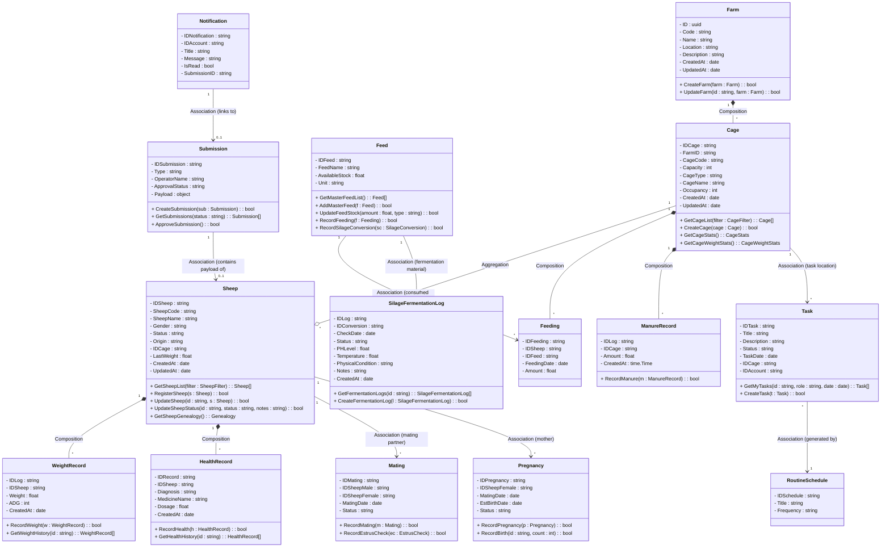

# Desain Arsitektur: Class Diagram Backend Peternakan (Farmease)

Dokumen ini memuat **Class Diagram** utama yang memodelkan keseluruhan modul yang ada di dalam Go Backend Peternakan (`farmease-be`). Seluruh entitas saling terhubung menggunakan relasi standar UML, menggabungkan data (atribut) dan perilaku (metode) langsung di dalam kelas entitas utama sesuai dengan prinsip pemrograman berorientasi objek (OOP).

---

## Class Diagram Backend (`farmease-be`)

Diagram ini dimodelkan menggunakan format kelas Mermaid dengan seluruh atribut diatur sebagai private (`-`) dengan format `- nama_variabel : tipe_data`, serta metode publik (`+`) dengan format `+ nama_metode(parameter) : tipe_kembalian`.

---

## Penjelasan Relasi UML Kelas Backend

1. **Komposisi (Composition - Berlian Hitam `*--`)**
   * `Farm` ke `Cage`: Menunjukkan hubungan kepemilikan yang kuat di mana jika `Farm` dihapus, seluruh `Cage` di dalamnya ikut terhapus (*cascade delete*).
   * `Sheep` ke `WeightRecord` & `HealthRecord`: Catatan timbangan atau rekam medis tidak dapat berdiri sendiri jika domba yang bersangkutan dihapus dari sistem.
   * `Cage` ke `Feeding` & `ManureRecord`: Log pemberian pakan kandang atau pembuangan kotoran kandang akan ikut terhapus jika kandang tersebut dihapus.
2. **Agregasi (Aggregation - Berlian Kosong `--o`)**
   * `Cage` ke `Sheep`: Hubungan wadah di mana `Sheep` dapat berpindah kandang, sehingga jika `Cage` dihapus, data `Sheep` tidak terhapus.
3. **Asosiasi (Association - Garis Panah Solid `-->`)**
   * Hubungan referensi atau keterkaitan antara dua objek mandiri (misal: `Feed` yang dirujuk di log `Feeding`, atau `Task` yang merujuk pada lokasi `Cage`).
