# Sequence Diagram Modular: Alur Fungsional Sistem Peternakan (Farmease)

Dokumen ini memuat diagram urutan (*sequence diagram*) untuk masing-masing Use Case pada Sistem Pencatatan Ternak Farmease. Seluruh pemanggilan method pada lifeline entitas konsisten dengan method yang terdapat di dalam **Class Diagram**.

---

## UC-01: Melihat Dasbor Ternak
Menampilkan ringkasan populasi, statistik kesehatan kandang, tingkat okupansi kandang, dan log aktivitas terbaru.

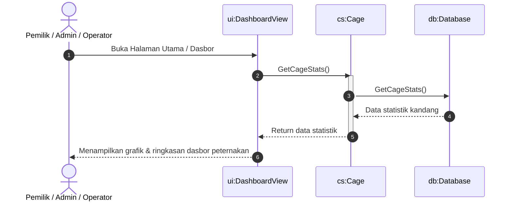

---

## UC-02: Kelola Data Identitas Domba

### 2.1. Registrasi Domba Baru
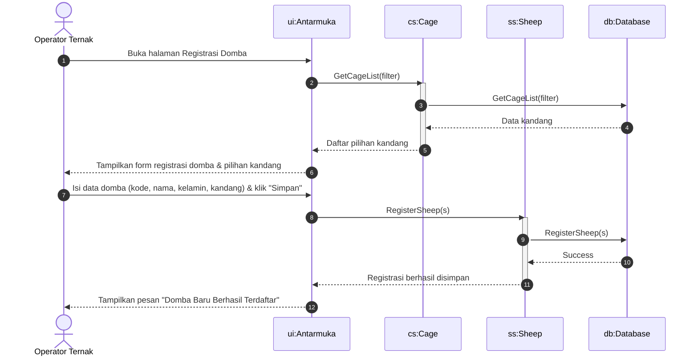

### 2.2. Mutasi Kandang Domba
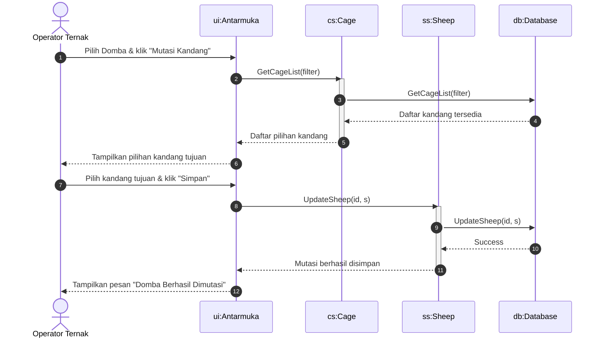

---

## UC-03: Kelola Data Peternakan

### 3.1. Pencatatan Perkawinan & Kelahiran Anak Domba
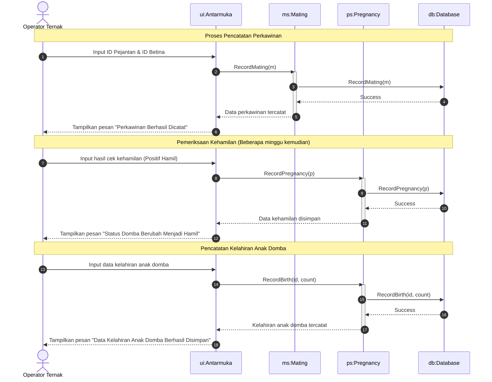

### 3.2. Pencatatan Pemberian Pakan Harian
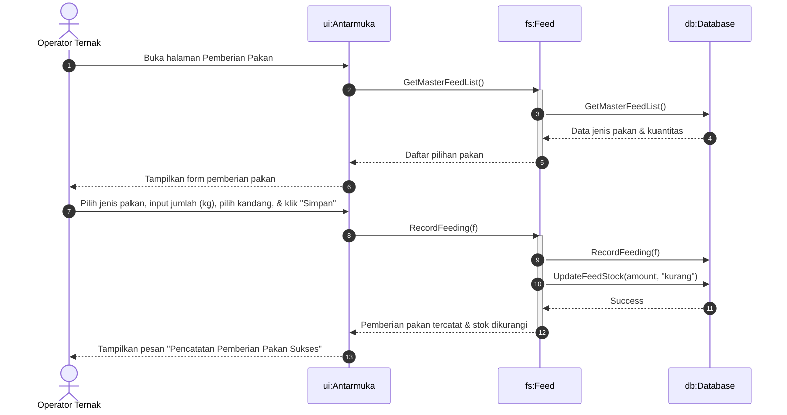

### 3.3. Pencatatan Bobot Domba & ADG
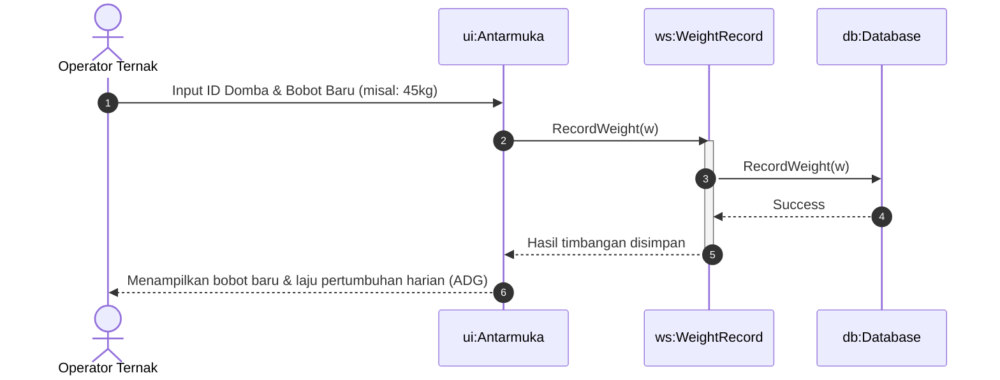

---

## UC-04: Kelola Stok Pakan

### 4.1. Pembuatan Batch Fermentasi Silase
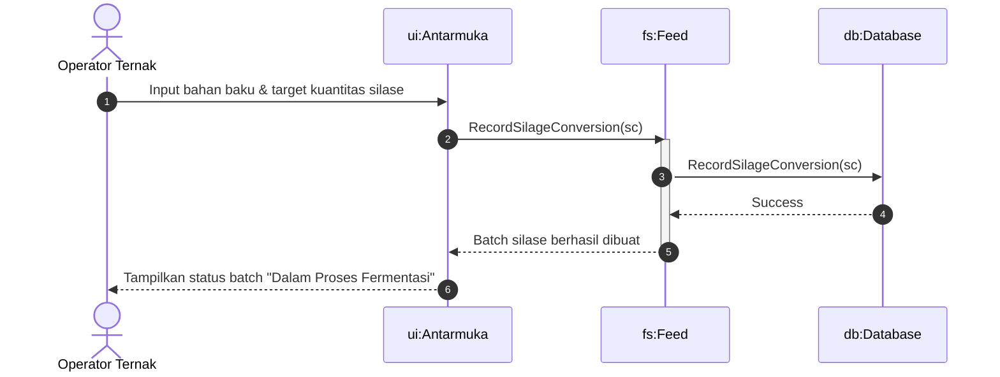

### 4.2. Pencatatan Log Aktivitas Fermentasi
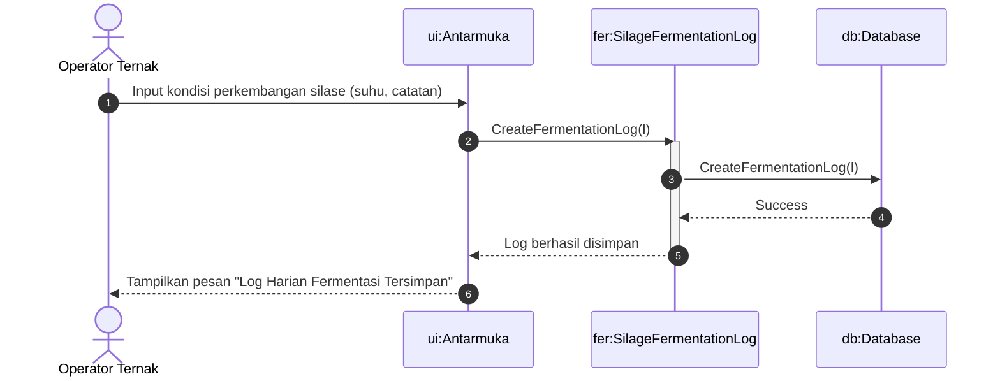

---

## UC-05: Menvalidasi Pencatatan Operator
*(Catatan: Detail diagram sekuensial lengkap untuk proses peninjauan, persetujuan admin, dan integrasi pesan RabbitMQ dipisahkan di berkas `livestock_architecture_sequence_diagram.md`).*

---

## UC-06: Melihat Silsilah Domba

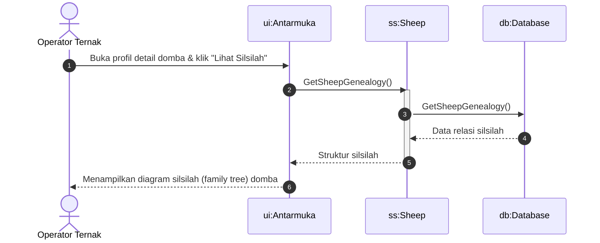

---

## UC-07: Kelola Data Birahi

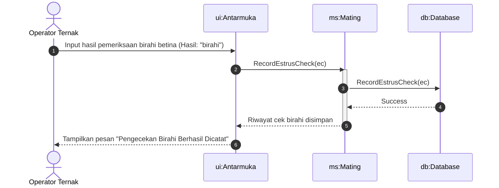

---

## UC-08: Melihat Riwayat Kesehatan

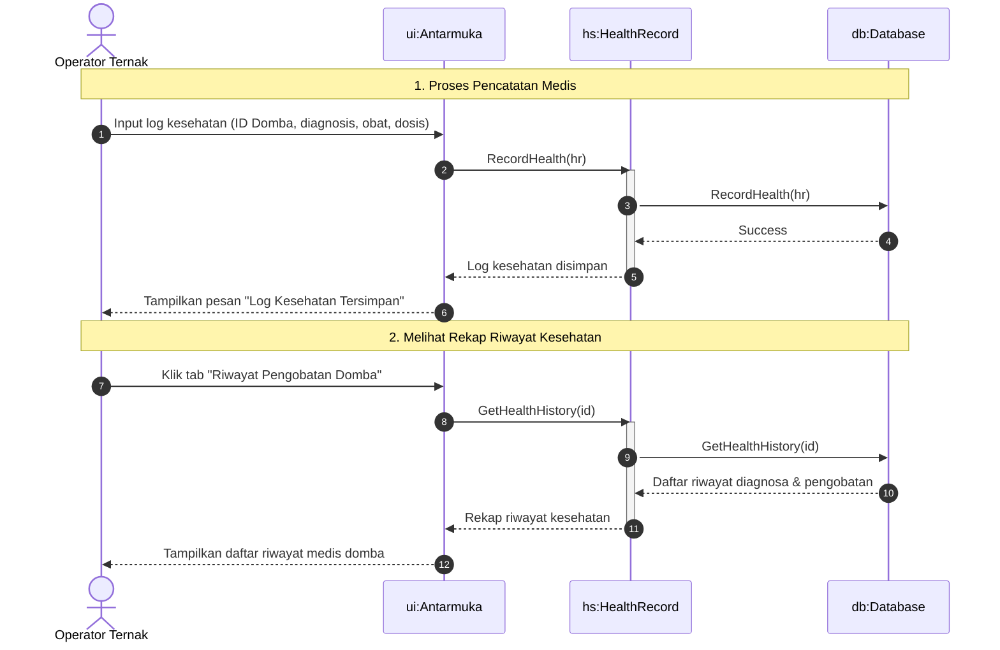
