# Sequence Diagram Modular: Alur Fungsional Sistem Peternakan (Farmease)

Dokumen ini memuat diagram urutan (*sequence diagram*) untuk masing-masing Use Case pada Sistem Pencatatan Ternak Farmease. Diagram ini menggunakan pendekatan konseptual tingkat tinggi (High-Level Conceptual) untuk mempermudah pemahaman alur sistem bagi pembimbing dan penguji.

---

## UC-01: Melihat Dasbor Ternak
Menampilkan ringkasan populasi, statistik kesehatan kandang, tingkat okupansi kandang, dan log aktivitas terbaru.

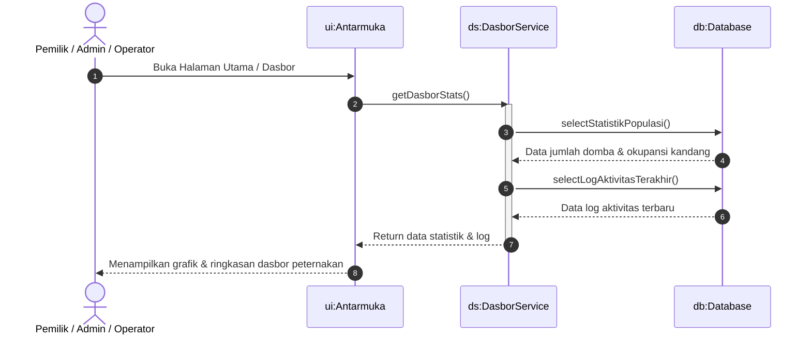

---

## UC-02: Kelola Data Identitas Domba
Menangani proses registrasi identitas domba baru serta mutasi pemindahan domba antar-kandang.

### 2.1. Registrasi Domba Baru
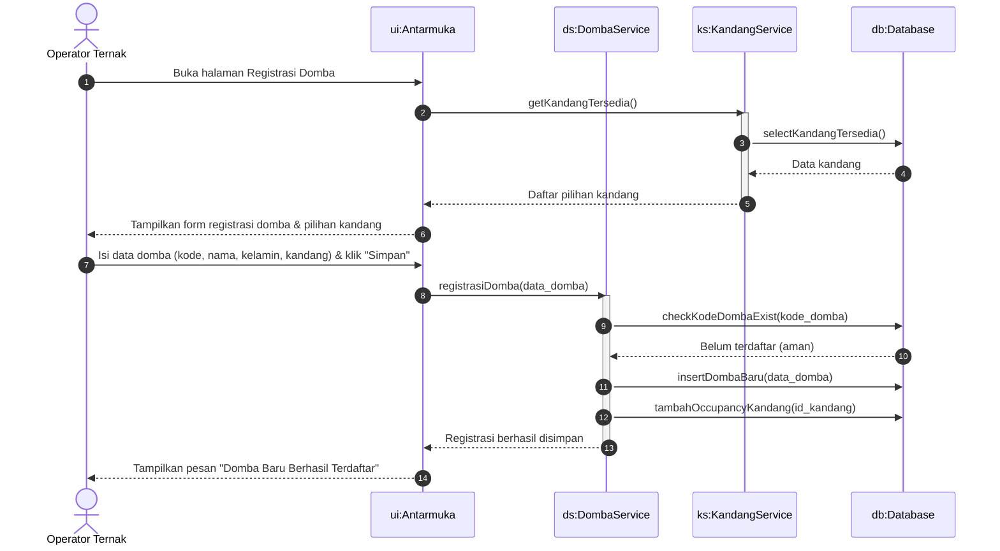

### 2.2. Mutasi Kandang Domba
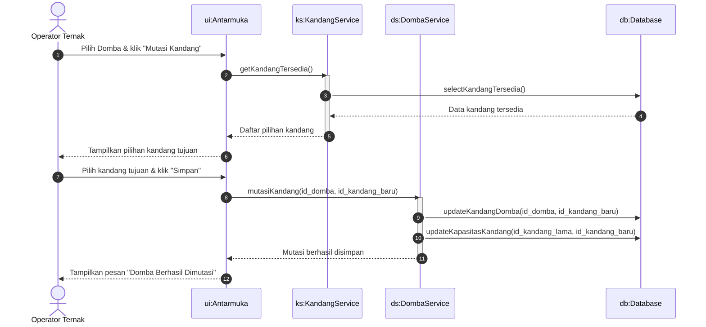

---

## UC-03: Kelola Data Peternakan
Merupakan alur pencatatan fungsionalitas harian domba (pakan harian, kawin/reproduksi, berat/ADG).

### 3.1. Pencatatan Perkawinan & Kelahiran Anak Domba
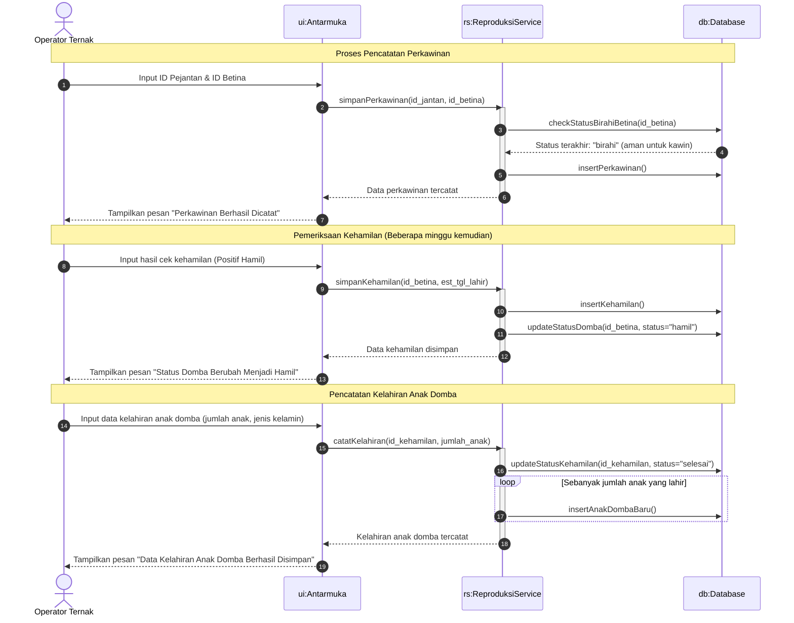

### 3.2. Pencatatan Pemberian Pakan Harian
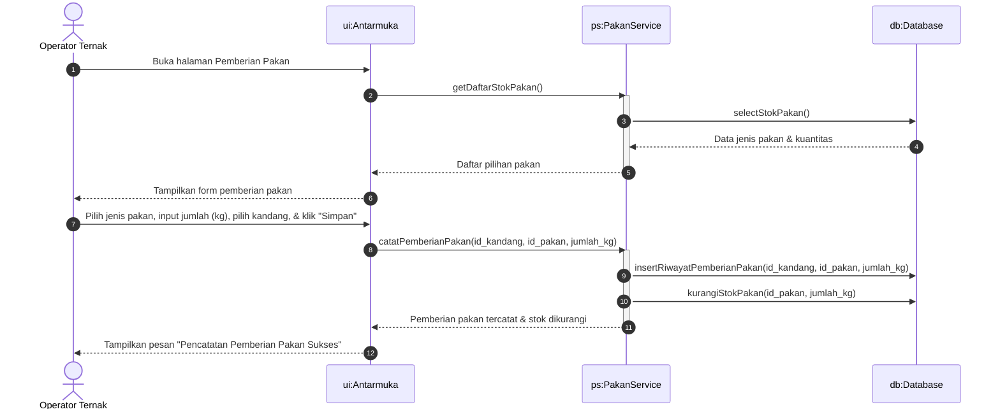

### 3.3. Pencatatan Bobot Domba & ADG
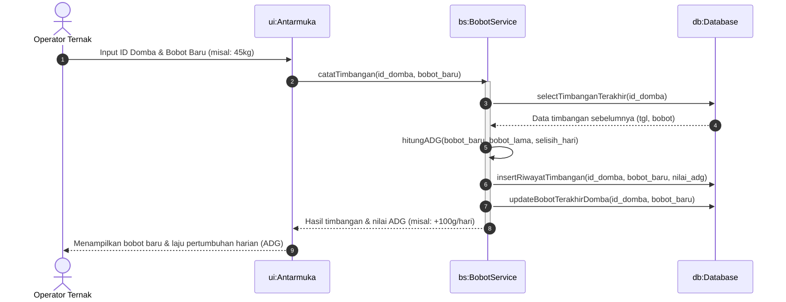

---

## UC-04: Kelola Stok Pakan
Menangani aktivitas produksi batch pakan fermentasi (silase) serta mencatat log perkembangan fermentasi.

### 4.1. Pembuatan Batch Fermentasi Silase
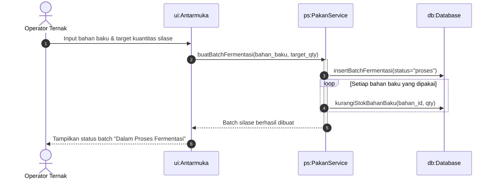

### 4.2. Pencatatan Log Aktivitas Fermentasi
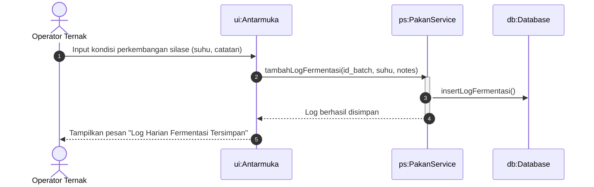

---

## UC-05: Menvalidasi Pencatatan Operator
*(Catatan: Detail diagram sekuensial lengkap untuk proses peninjauan, persetujuan admin, dan integrasi pesan RabbitMQ dipisahkan di berkas `livestock_architecture_sequence_diagram.md` untuk kejelasan arsitektur sistem).*

---

## UC-06: Melihat Silsilah Domba
Menampilkan silsilah kekerabatan (*family tree*) domba untuk memantau garis keturunan dan menghindari kawin sedarah.

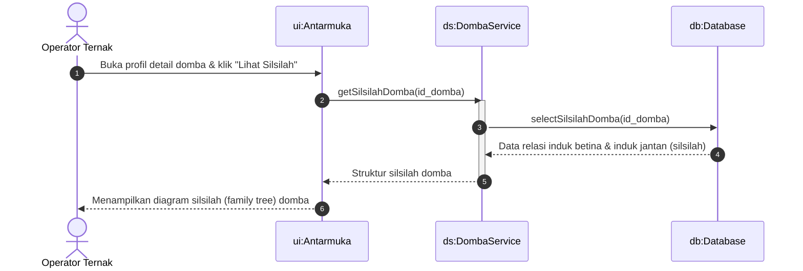

---

## UC-07: Kelola Data Birahi
Mencatat riwayat pengecekan birahi betina sebelum melangkah ke proses kawin.

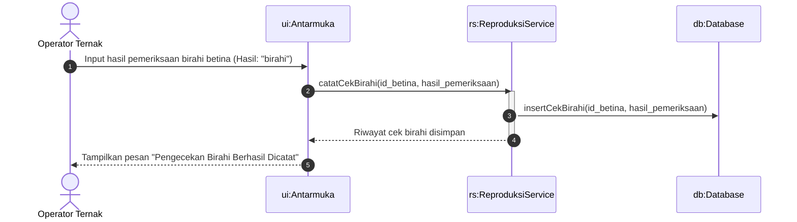

---

## UC-08: Melihat Riwayat Kesehatan
Mencatat keluhan sakit serta melihat rekap riwayat medis/pengobatan pada domba.

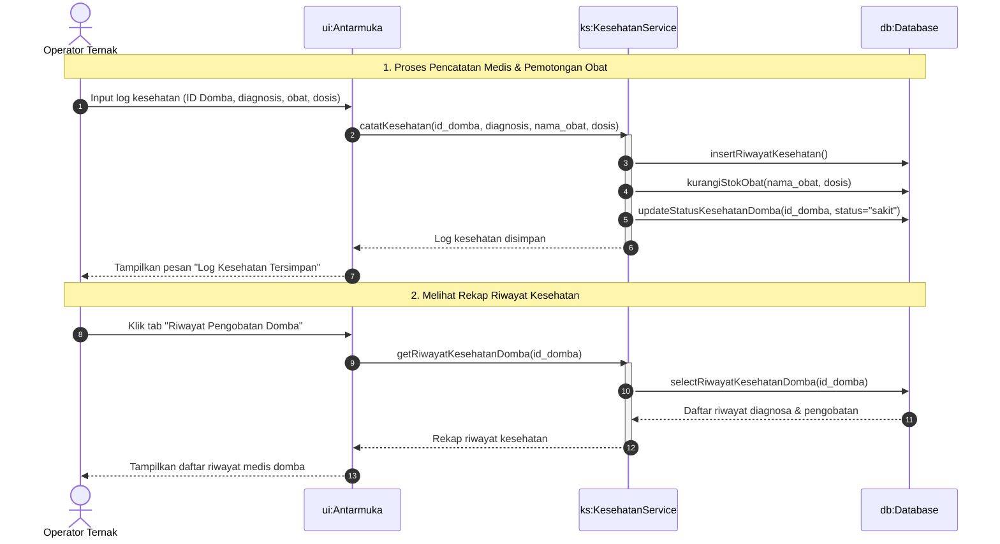
