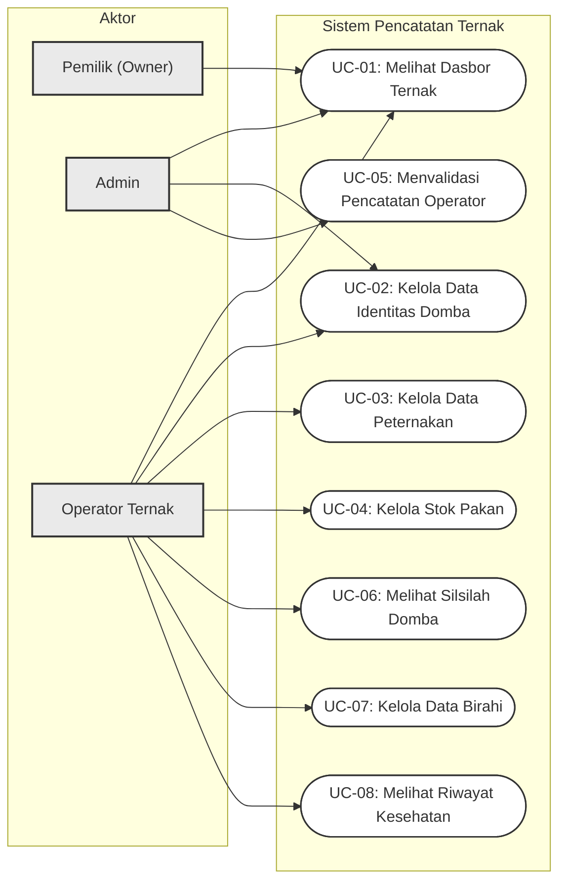

# Desain Arsitektur: Use Case Diagram Sistem Peternakan (Farmease)

Dokumen ini memuat diagram kasus penggunaan (*Use Case Diagram*) hasil revisi final sesuai draf diagram terbaru Anda. Diagram ini membagi fungsionalitas ke dalam 8 Use Case utama terurut yang terhubung dengan aktor Pemilik, Admin, dan Operator Ternak.

---

## Use Case Diagram Terbaru

Diagram ini menggunakan batas sistem bernama **"Sistem Pencatatan Ternak"**:

---

## Deskripsi Use Case (Use Case Specifications)

Berikut adalah rincian fungsionalitas untuk masing-masing Use Case di atas:

### 1. UC-01: Melihat Dasbor Ternak
*   **Aktor**: Pemilik, Admin, Operator Ternak
*   **Deskripsi**: Menampilkan statistik perkembangan peternakan seperti total domba, kondisi kesehatan kandang, dan aktivitas terbaru.

### 2. UC-02: Kelola Data Identitas Domba
*   **Aktor**: Admin, Operator Ternak
*   **Deskripsi**: Melakukan pendaftaran domba baru (registrasi kode, jenis kelamin, varietas) dan pemindahan (mutasi) domba antar-kandang.

### 3. UC-03: Kelola Data Peternakan
*   **Aktor**: Operator Ternak
*   **Deskripsi**: Merupakan fitur inti perekaman aktivitas harian domba yang mencakup:
    *   Pencatatan pemberian pakan harian.
    *   Pencatatan perkawinan (*mating*).
    *   Pencatatan kehamilan & kelahiran anak domba baru.
    *   Pencatatan timbangan berat badan & ADG (*Average Daily Gain*).

### 4. UC-04: Kelola Stok Pakan
*   **Aktor**: Operator Ternak
*   **Deskripsi**: Mencatat aktivitas pembuatan pakan silase (proses fermentasi) dan memantau persediaan pakan yang masuk.

### 5. UC-05: Menvalidasi Pencatatan Operator
*   **Aktor**: Admin
*   **Deskripsi**: Meninjau (menyetujui atau menolak) draf pencatatan data yang dikirimkan oleh Operator sebelum data resmi disimpan di database utama.

### 6. UC-06: Melihat Silsilah Domba
*   **Aktor**: Operator Ternak
*   **Deskripsi**: Menampilkan pohon silsilah genetik (*genealogy*) domba jantan dan betina untuk memantau silsilah perkawinan.

### 7. UC-07: Kelola Data Birahi
*   **Aktor**: Operator Ternak
*   **Deskripsi**: Merekam hasil pengecekan birahi (*estrus check*) domba betina sebagai prasyarat kelayakan kawin.

### 8. UC-08: Melihat Riwayat Kesehatan
*   **Aktor**: Operator Ternak
*   **Deskripsi**: Mencatat laporan domba sakit, diagnosa penyakit, serta melacak daftar riwayat pengobatan medis yang pernah dilakukan.
