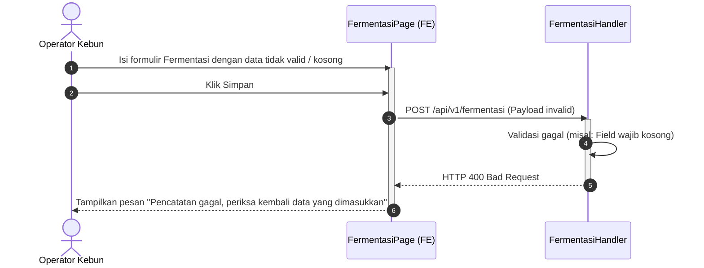
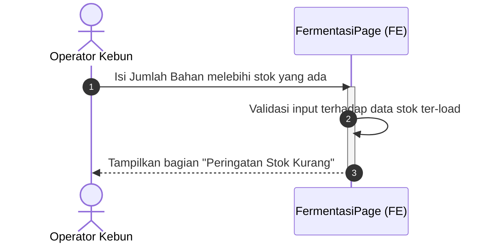
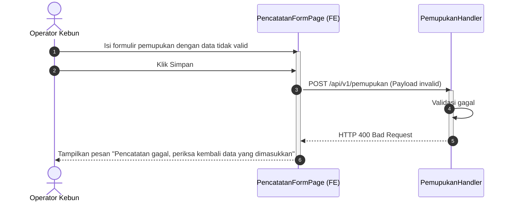
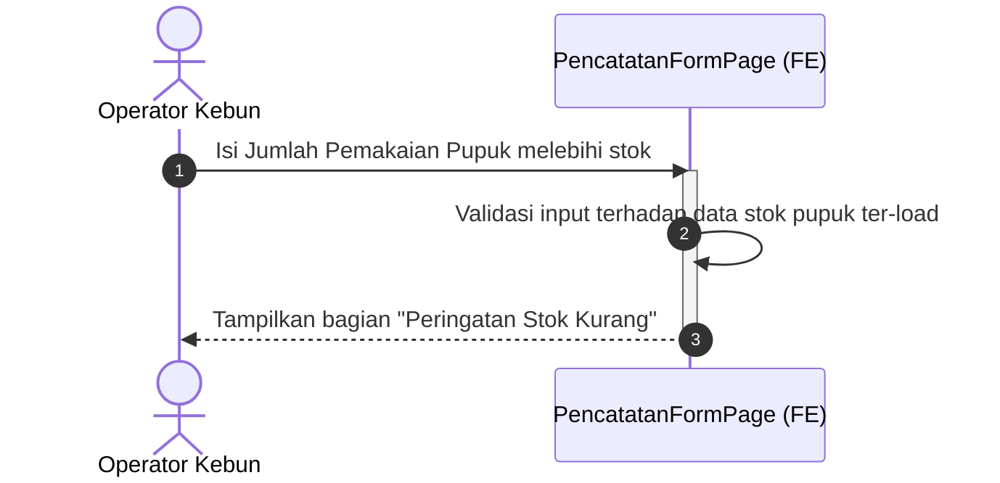
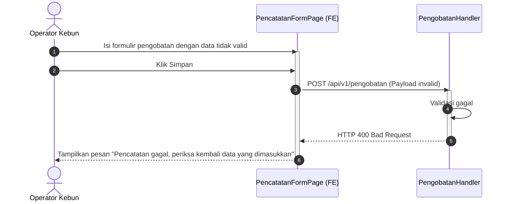
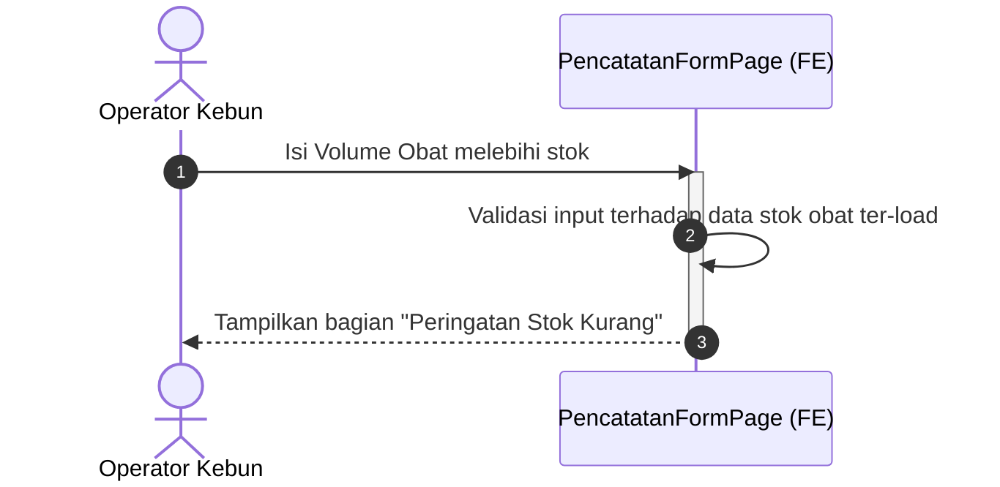

# Dokumentasi Sequence Diagram - Sistem Pencatatan Perkebunan (Farmease)

Dokumen ini berisi kumpulan Sequence Diagram untuk Use Case pencatatan perkebunan Farmease. Diagram dibuat berdasarkan skenario normal dan tidak normal pada dokumen Use Case Diagram (4 use case).

Komponen utama yang terlibat dalam diagram meliputi:
- **Aktor**: Pemilik, Admin, Operator Kebun
- **Frontend / View (FE)**: `DasborPerkebunanView`, `DasborLahanPage`, `FermentasiPage`, `PencatatanFormPage`
- **Auth Middleware**: Handler otentikasi & otorisasi role
- **Delivery / Handler (BE)**: Layer HTTP Controller Go backend (`LahanHandler`, `FermentasiHandler`, `PemupukanHandler`, `PengobatanHandler`, `StokHandler`)
- **Usecase / Service (BE)**: Layer business logic Go backend (`lahanUsecase`, `fermentasiUsecase`, `pemupukanUsecase`, `pengobatanUsecase`, `stokUsecase`)
- **Repository / Data Access (BE)**: Layer interaksi database (`lahanRepository`, `fermentasiRepository`, `pemupukanRepository`, `pengobatanRepository`, `stokRepository`)
- **Database (DB)**: PostgreSQL / Database utama

---

## UC-01: Melihat Dasbor
Use case ini memantau ringkasan kondisi terkini perkebunan melalui dasbor yang memisahkan informasi Lahan Alpukat dan Lahan Kelengkeng secara *real-time*.

### Skenario Normal-1: Pemilik berhasil melihat dasbor perkebunan
Pemilik melihat dasbor secara *read-only* (tanpa akses tambah/ubah/hapus data).

```mermaid
sequenceDiagram
    autonumber
    actor Owner as Pemilik
    participant UI as DasborPerkebunanView (FE)
    participant Mid as Auth Middleware
    participant Hnd as LahanHandler
    participant UC as lahanUsecase
    participant Repo as lahanRepository
    database DB as Database

    Owner->>UI: Memilih menu Dasbor Perkebunan
    activate UI
    UI->>Mid: GET /api/v1/lahan (Headers: Authorization)
    activate Mid
    Mid->>Mid: Validasi Token & Ambil Role (Role: Pemilik)
    Mid->>Hnd: Forward request (Context: Role = Pemilik)
    activate Hnd
    Hnd->>UC: FindAll()
    activate UC
    UC->>Repo: FindAll()
    activate Repo
    Repo->>DB: Query data lahan
    activate DB
    DB-->>Repo: Data lahan perkebunan
    deactivate DB
    Repo-->>UC: Data lahan
    deactivate Repo
    UC-->>Hnd: Lahan data list
    deactivate UC
    Hnd-->>Mid: JSON (Lahan data list, Read-only access)
    deactivate Hnd
    Mid-->>UI: JSON (Lahan data list, Read-only access)
    deactivate Mid
    UI->>UI: Saring data per lahan, sembunyikan tombol Ubah/Hapus
    UI-->>Owner: Tampilkan Dasbor Pemilik
    deactivate UI
```

### Skenario Normal-2: Admin berhasil melihat dasbor perkebunan
Admin melihat dasbor dengan tambahan akses Panel Admin di navigasi/sidebar.

```mermaid
sequenceDiagram
    autonumber
    actor Admin as Admin
    participant UI as DasborPerkebunanView (FE)
    participant Mid as Auth Middleware
    participant Hnd as LahanHandler
    participant UC as lahanUsecase
    participant Repo as lahanRepository
    database DB as Database

    Admin->>UI: Memilih menu Dasbor Perkebunan
    activate UI
    UI->>Mid: GET /api/v1/lahan (Headers: Authorization)
    activate Mid
    Mid->>Mid: Validasi Token & Ambil Role (Role: Admin)
    Mid->>Hnd: Forward request (Context: Role = Admin)
    activate Hnd
    Hnd->>UC: FindAll()
    activate UC
    UC->>Repo: FindAll()
    activate Repo
    Repo->>DB: Query data lahan
    activate DB
    DB-->>Repo: Data lahan perkebunan
    deactivate DB
    Repo-->>UC: Data lahan
    deactivate Repo
    UC-->>Hnd: Lahan data list
    deactivate UC
    Hnd-->>Mid: JSON (Lahan data list + Admin panel access)
    deactivate Hnd
    Mid-->>UI: JSON (Lahan data list + Admin panel access)
    deactivate Mid
    UI->>UI: Tampilkan sidebar navigasi Panel Admin
    UI-->>Admin: Tampilkan Dasbor Admin
    deactivate UI
```

### Skenario Normal-3: Operator Kebun berhasil melihat dasbor perkebunan
Operator Kebun melihat dasbor lahan tanggung jawabnya.

```mermaid
sequenceDiagram
    autonumber
    actor Op as Operator Kebun
    participant UI as DasborLahanPage (FE)
    participant Mid as Auth Middleware
    participant Hnd as LahanHandler
    participant UC as lahanUsecase
    participant Repo as lahanRepository
    database DB as Database

    Op->>UI: Memilih menu Dasbor Perkebunan
    activate UI
    UI->>Mid: GET /api/v1/lahan (Headers: Authorization)
    activate Mid
    Mid->>Mid: Validasi Token & Ambil Role
    Mid->>Hnd: Forward request (Context: Role = Operator)
    activate Hnd
    Hnd->>UC: FindAll()
    activate UC
    UC->>Repo: FindAll()
    activate Repo
    Repo->>DB: Query Lahan
    activate DB
    DB-->>Repo: Data Lahan
    deactivate DB
    Repo-->>UC: Data Lahan
    deactivate Repo
    UC-->>Hnd: Lahan data list
    deactivate UC
    Hnd-->>Mid: JSON (Lahan data list)
    deactivate Hnd
    Mid-->>UI: JSON (Lahan data list)
    deactivate Mid
    UI->>UI: Saring data lahan tanggung jawab Operator
    UI-->>Op: Tampilkan Dasbor Operator Kebun
    deactivate UI
```

### Skenario Tidak Normal-1: Dasbor gagal dimuat
Dasbor gagal dimuat dikarenakan gangguan koneksi ke database.

```mermaid
sequenceDiagram
    autonumber
    actor Aktor as Aktor
    participant UI as DasborPerkebunanView (FE)
    participant Mid as Auth Middleware
    participant Hnd as LahanHandler
    participant UC as lahanUsecase
    participant Repo as lahanRepository
    database DB as Database

    Aktor->>UI: Memilih menu Dasbor Perkebunan
    activate UI
    UI->>Mid: GET /api/v1/lahan (Headers: Authorization)
    activate Mid
    Mid->>Mid: Validasi Token & Ambil Role
    Mid->>Hnd: Forward request
    activate Hnd
    Hnd->>UC: FindAll()
    activate UC
    UC->>Repo: FindAll()
    activate Repo
    Repo->>DB: Query data (Database down/timeout)
    activate DB
    DB-->>Repo: Error / Connection Timeout
    deactivate DB
    Repo-->>UC: Error
    deactivate Repo
    UC-->>Hnd: Error
    deactivate UC
    Hnd-->>Mid: HTTP 500 Internal Server Error
    deactivate Hnd
    Mid-->>UI: HTTP 500 Internal Server Error
    deactivate Mid
    UI-->>Aktor: Tampilkan pesan "Dasbor tidak dapat dimuat, silakan coba kembali"
    deactivate UI
```

---

## UC-02: Kelola Data Pengolahan Pupuk
Operator Kebun dapat mencatat fermentasi dan menambahkan log cek berkala.

### Skenario Normal-1: Operator Kebun berhasil mencatat proses fermentasi pupuk
Pencatatan awal fermentasi dengan memeriksa ketersediaan stok bahan baku.

```mermaid
sequenceDiagram
    autonumber
    actor Op as Operator Kebun
    participant UI as FermentasiPage (FE)
    participant StokHnd as StokHandler
    participant FermHnd as FermentasiHandler
    participant StokUC as stokUsecase
    participant FermUC as fermentasiUsecase
    participant StokRepo as stokRepository
    participant FermRepo as fermentasiRepository
    database DB as Database

    Op->>UI: Memilih Pengolahan Pupuk -> Fermentasi
    activate UI
    UI->>StokHnd: GET /api/v1/stok/bahan
    activate StokHnd
    StokHnd->>StokUC: FindAllBahan()
    activate StokUC
    StokUC->>StokRepo: FindAllBahan()
    activate StokRepo
    StokRepo->>DB: Query stok bahan
    activate DB
    DB-->>StokRepo: Data stok bahan
    deactivate DB
    StokRepo-->>StokUC: Data stok bahan
    deactivate StokRepo
    StokUC-->>StokHnd: Stok bahan list
    deactivate StokUC
    StokHnd-->>UI: JSON (Stok bahan list)
    deactivate StokHnd
    UI-->>Op: Tampilkan Informasi Stok Bahan & Formulir Fermentasi
    deactivate UI

    Op->>UI: Isi data fermentasi & Klik Simpan
    activate UI
    UI->>FermHnd: POST /api/v1/fermentasi (Payload data)
    activate FermHnd
    FermHnd->>FermHnd: Validasi format data & field wajib
    FermHnd->>FermUC: CreatePupukFermentasi(data)
    activate FermUC
    FermUC->>FermRepo: Store(data)
    activate FermRepo
    FermRepo->>DB: Insert ke tabel fermentasi
    activate DB
    DB-->>FermRepo: Success
    deactivate DB
    FermRepo-->>FermUC: Success
    deactivate FermRepo
    FermUC-->>FermHnd: Success
    deactivate FermUC
    FermHnd-->>UI: HTTP 201 Created (Success message)
    deactivate FermHnd
    UI-->>Op: Tampilkan pesan sukses & Log tersimpan
    deactivate UI
```

### Skenario Normal-2: Operator Kebun berhasil melakukan cek fermentasi dan pupuk dinyatakan siap digunakan
Log pengecekan ditambahkan, status batch dirubah menjadi "Siap Digunakan", dan volume stok pupuk jadi ditambahkan.

```mermaid
sequenceDiagram
    autonumber
    actor Op as Operator Kebun
    participant UI as CekFermentasiPage (FE)
    participant FermHnd as FermentasiHandler
    participant StokHnd as StokHandler
    participant FermUC as fermentasiUsecase
    participant StokUC as stokUsecase
    participant FermRepo as fermentasiRepository
    database DB as Database

    Op->>UI: Memilih Pengolahan Pupuk -> Cek Fermentasi
    activate UI
    UI->>FermHnd: GET /api/v1/fermentasi/:id
    activate FermHnd
    FermHnd->>FermUC: FindByID(id)
    activate FermUC
    FermUC->>FermRepo: FindByID(id)
    activate FermRepo
    FermRepo->>DB: Query detail batch fermentasi
    activate DB
    DB-->>FermRepo: Data batch fermentasi
    deactivate DB
    FermRepo-->>FermUC: Data batch fermentasi
    deactivate FermRepo
    FermUC-->>FermHnd: Data batch fermentasi
    deactivate FermUC
    FermHnd-->>UI: JSON (Data batch fermentasi)
    deactivate FermHnd
    UI-->>Op: Tampilkan formulir Cek Fermentasi
    deactivate UI

    Op->>UI: Isi log cek. Pilih status: "Siap Digunakan" & Klik Simpan
    activate UI
    UI->>FermHnd: POST /api/v1/fermentasi/log (Payload log)
    activate FermHnd
    FermHnd->>FermUC: AddLog(log)
    activate FermUC
    FermUC->>FermRepo: StoreLog(log)
    activate FermRepo
    FermRepo->>DB: Insert log pengecekan
    activate DB
    DB-->>FermRepo: Success
    deactivate DB
    FermRepo-->>FermUC: Success
    deactivate FermRepo
    FermUC-->>FermHnd: Success
    deactivate FermUC
    FermHnd-->>UI: HTTP 201 Created
    deactivate FermHnd

    UI->>FermHnd: PATCH /api/v1/fermentasi/:id/status?status=Siap+Digunakan
    activate FermHnd
    FermHnd->>FermUC: UpdateStatus(id, status)
    activate FermUC
    FermUC->>FermRepo: UpdateStatus(id, status)
    activate FermRepo
    FermRepo->>DB: Update status batch fermentasi
    activate DB
    DB-->>FermRepo: Success
    deactivate DB
    FermRepo-->>FermUC: Success
    deactivate FermRepo
    FermUC-->>FermHnd: Success
    deactivate FermUC
    FermHnd-->>UI: HTTP 200 OK
    deactivate FermHnd

    UI->>StokHnd: PATCH /api/v1/stok/pupuk/:id?amount=100&type=tambah
    activate StokHnd
    StokHnd->>StokUC: UpdatePupukStock(id, amount, type)
    activate StokUC
    StokUC->>DB: Update stok pupuk
    activate DB
    DB-->>StokUC: Success
    deactivate DB
    StokUC-->>StokHnd: Success
    deactivate StokUC
    StokHnd-->>UI: HTTP 200 OK
    deactivate StokHnd
    UI-->>Op: Pindahkan hasil fermentasi ke stok & Tampilkan pesan sukses
    deactivate UI
```

### Skenario Normal-3: Operator Kebun mencatat kegagalan proses fermentasi
Merubah status batch fermentasi menjadi "Gagal".

```mermaid
sequenceDiagram
    autonumber
    actor Op as Operator Kebun
    participant UI as CekFermentasiPage (FE)
    participant FermHnd as FermentasiHandler
    participant FermUC as fermentasiUsecase
    participant FermRepo as fermentasiRepository
    database DB as Database

    Op->>UI: Memilih Cek Fermentasi pada batch gagal
    activate UI
    UI->>FermHnd: GET /api/v1/fermentasi/:id
    activate FermHnd
    FermHnd->>FermUC: FindByID(id)
    activate FermUC
    FermUC->>FermRepo: FindByID(id)
    activate FermRepo
    FermRepo-->>FermUC: Data batch
    deactivate FermRepo
    FermUC-->>FermHnd: Data batch
    deactivate FermUC
    FermHnd-->>UI: JSON (Data batch)
    deactivate FermHnd
    UI-->>Op: Tampilkan formulir Cek Fermentasi
    deactivate UI

    Op->>UI: Pilih Status: "Gagal" & Klik Simpan
    activate UI
    UI->>FermHnd: PATCH /api/v1/fermentasi/:id/status?status=Gagal
    activate FermHnd
    FermHnd->>FermUC: UpdateStatus(id, "Gagal")
    activate FermUC
    FermUC->>FermRepo: UpdateStatus(id, "Gagal")
    activate FermRepo
    FermRepo->>DB: Update status batch fermentasi
    activate DB
    DB-->>FermRepo: Success
    deactivate DB
    FermRepo-->>FermUC: Success
    deactivate FermRepo
    FermUC-->>FermHnd: Success
    deactivate FermUC
    FermHnd-->>UI: HTTP 200 OK
    deactivate FermHnd
    UI-->>Op: Ubah status menjadi gagal & Tampilkan notifikasi sukses
    deactivate UI
```

### Skenario Tidak Normal-1: Pencatatan pengolahan pupuk gagal karena data tidak valid
Data tidak lengkap atau format tidak sesuai.



### Skenario Tidak Normal-2: Jumlah bahan yang dimasukkan melebihi stok tersedia
Validasi stok dilakukan secara client-side di sisi Frontend.



---

## UC-03: Kelola Data Pemupukan

### Skenario Normal-1: Operator Kebun membuka formulir pencatatan pemupukan
Memuat daftar lahan aktif dan stok pupuk.

```mermaid
sequenceDiagram
    autonumber
    actor Op as Operator Kebun
    participant UI as PencatatanFormPage (FE)
    participant LahanHnd as LahanHandler
    participant StokHnd as StokHandler
    participant LahanUC as lahanUsecase
    participant StokUC as stokUsecase
    participant LahanRepo as lahanRepository
    database DB as Database

    Op->>UI: Pilih jenis Pemupukan
    activate UI
    UI->>LahanHnd: GET /api/v1/lahan
    activate LahanHnd
    LahanHnd->>LahanUC: FindAll()
    activate LahanUC
    LahanUC->>LahanRepo: FindAll()
    activate LahanRepo
    LahanRepo->>DB: Query data lahan
    activate DB
    DB-->>LahanRepo: Data lahan
    deactivate DB
    LahanRepo-->>LahanUC: Data lahan
    deactivate LahanRepo
    LahanUC-->>LahanHnd: Lahan list
    deactivate LahanUC
    LahanHnd-->>UI: JSON (Daftar Lahan)
    deactivate LahanHnd

    UI->>StokHnd: GET /api/v1/stok/pupuk
    activate StokHnd
    StokHnd->>StokUC: FindAllPupuk()
    activate StokUC
    StokUC->>DB: Query data stok pupuk
    activate DB
    DB-->>StokUC: Data stok pupuk
    deactivate DB
    StokUC-->>StokHnd: Stok pupuk list
    deactivate StokUC
    StokHnd-->>UI: JSON (Daftar Pupuk)
    deactivate StokHnd
    UI-->>Op: Tampilkan Form Pemupukan dengan pilihan terfilter
    deactivate UI
```

### Skenario Normal-2: Operator Kebun berhasil mencatat pemupukan dengan pupuk hasil fermentasi
Menyimpan data catatan pemupukan, lalu melakukan pengurangan sisa volume stok pupuk jadi.

```mermaid
sequenceDiagram
    autonumber
    actor Op as Operator Kebun
    participant UI as PencatatanFormPage (FE)
    participant PemupukanHnd as PemupukanHandler
    participant StokHnd as StokHandler
    participant PemupukanUC as pemupukanUsecase
    participant StokUC as stokUsecase
    participant PemupukanRepo as pemupukanRepository
    database DB as Database

    Op->>UI: Isi data pemupukan & Klik Simpan
    activate UI
    UI->>PemupukanHnd: POST /api/v1/pemupukan (Payload data)
    activate PemupukanHnd
    PemupukanHnd->>PemupukanHnd: Validasi data
    PemupukanHnd->>PemupukanUC: Create(data)
    activate PemupukanUC
    PemupukanUC->>PemupukanRepo: Store(data)
    activate PemupukanRepo
    PemupukanRepo->>DB: Save data pemupukan
    activate DB
    DB-->>PemupukanRepo: Success
    deactivate DB
    PemupukanRepo-->>PemupukanUC: Success
    deactivate PemupukanRepo
    PemupukanUC-->>PemupukanHnd: Success
    deactivate PemupukanUC
    PemupukanHnd-->>UI: HTTP 201 Created
    deactivate PemupukanHnd

    UI->>StokHnd: PATCH /api/v1/stok/pupuk/:id?amount=10&type=kurang
    activate StokHnd
    StokHnd->>StokUC: UpdatePupukStock(id, amount, type)
    activate StokUC
    StokUC->>DB: Update stok pupuk
    activate DB
    DB-->>StokUC: Success
    deactivate DB
    StokUC-->>StokHnd: Success
    deactivate StokUC
    StokHnd-->>UI: HTTP 200 OK
    deactivate StokHnd
    UI-->>Op: Tampilkan status sukses pencatatan & stok pupuk ter-depresiasi
    deactivate UI
```

### Skenario Tidak Normal-1: Pencatatan pemupukan gagal karena data tidak valid



### Skenario Tidak Normal-2: Jumlah pupuk yang dimasukkan melebihi stok tersedia
Validasi stok pupuk secara client-side.



---

## UC-04: Kelola Data Pemberian Obat

### Skenario Normal-1: Operator Kebun membuka formulir pencatatan pemberian obat
Memuat daftar lahan aktif dan stok obat.

```mermaid
sequenceDiagram
    autonumber
    actor Op as Operator Kebun
    participant UI as PencatatanFormPage (FE)
    participant LahanHnd as LahanHandler
    participant StokHnd as StokHandler
    participant LahanUC as lahanUsecase
    participant StokUC as stokUsecase
    participant LahanRepo as lahanRepository
    database DB as Database

    Op->>UI: Pilih jenis Pemberian Obat
    activate UI
    UI->>LahanHnd: GET /api/v1/lahan
    activate LahanHnd
    LahanHnd->>LahanUC: FindAll()
    activate LahanUC
    LahanUC->>LahanRepo: FindAll()
    activate LahanRepo
    LahanRepo->>DB: Query data lahan
    activate DB
    DB-->>LahanRepo: Data Lahan
    deactivate DB
    LahanRepo-->>LahanUC: Data Lahan
    deactivate LahanRepo
    LahanUC-->>LahanHnd: Lahan list
    deactivate LahanUC
    LahanHnd-->>UI: JSON (Daftar Lahan)
    deactivate LahanHnd

    UI->>StokHnd: GET /api/v1/stok/obat
    activate StokHnd
    StokHnd->>StokUC: FindAllObat()
    activate StokUC
    StokUC->>DB: Query data stok obat
    activate DB
    DB-->>StokUC: Data obat
    deactivate DB
    StokUC-->>StokHnd: Stok obat list
    deactivate StokUC
    StokHnd-->>UI: JSON (Daftar Obat)
    deactivate StokHnd
    UI-->>Op: Tampilkan Form Pemberian Obat dengan dropdown terfilter
    deactivate UI
```

### Skenario Normal-2: Operator Kebun berhasil mencatat pemberian obat dengan rekomendasi otomatis
Mendapatkan rekomendasi dosis obat lewat backend API, menyimpan catatan pengobatan, lalu mendepresiasi stok obat.

```mermaid
sequenceDiagram
    autonumber
    actor Op as Operator Kebun
    participant UI as PencatatanFormPage (FE)
    participant PengobatanHnd as PengobatanHandler
    participant StokHnd as StokHandler
    participant PengobatanUC as pengobatanUsecase
    participant StokUC as stokUsecase
    participant PengobatanRepo as pengobatanRepository
    database DB as Database

    Op->>UI: Isi form pemberian obat
    activate UI
    UI->>PengobatanHnd: GET /api/v1/pengobatan/rekomendasi?varietas=A&fase=B&obat=C
    activate PengobatanHnd
    PengobatanHnd->>PengobatanUC: GetRekomendasi()
    activate PengobatanUC
    PengobatanUC->>DB: GetRekomendasiObat(varietas, fase, obat)
    activate DB
    DB-->>PengobatanUC: Aturan Dosis Rekomendasi
    deactivate DB
    PengobatanUC-->>PengobatanHnd: Rekomendasi data
    deactivate PengobatanUC
    PengobatanHnd-->>UI: JSON (Rekomendasi data)
    deactivate PengobatanHnd
    UI-->>Op: Tampilkan Rekomendasi Dosis otomatis di form
    deactivate UI

    Op->>UI: Isi Volume Obat & Klik Simpan
    activate UI
    UI->>PengobatanHnd: POST /api/v1/pengobatan (Payload data)
    activate PengobatanHnd
    PengobatanHnd->>PengobatanHnd: Validasi data
    PengobatanHnd->>PengobatanUC: Create(data)
    activate PengobatanUC
    PengobatanUC->>PengobatanRepo: Store(data)
    activate PengobatanRepo
    PengobatanRepo->>DB: Save data pengobatan
    activate DB
    DB-->>PengobatanRepo: Success
    deactivate DB
    PengobatanRepo-->>PengobatanUC: Success
    deactivate PengobatanRepo
    PengobatanUC-->>PengobatanHnd: Success
    deactivate PengobatanUC
    PengobatanHnd-->>UI: HTTP 201 Created
    deactivate PengobatanHnd

    UI->>StokHnd: PATCH /api/v1/stok/obat/:id?amount=5&type=kurang
    activate StokHnd
    StokHnd->>StokUC: UpdateObatStock(id, amount, type)
    activate StokUC
    StokUC->>DB: Update stok obat
    activate DB
    DB-->>StokUC: Success
    deactivate DB
    StokUC-->>StokHnd: Success
    deactivate StokUC
    StokHnd-->>UI: HTTP 200 OK
    deactivate StokHnd
    UI-->>Op: Tampilkan status sukses & stok obat ter-depresiasi
    deactivate UI
```

### Skenario Tidak Normal-1: Pencatatan pemberian obat gagal karena data tidak valid



### Skenario Tidak Normal-2: Volume obat yang dimasukkan melebihi stok tersedia
Validasi stok obat secara client-side.


